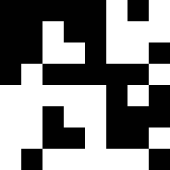
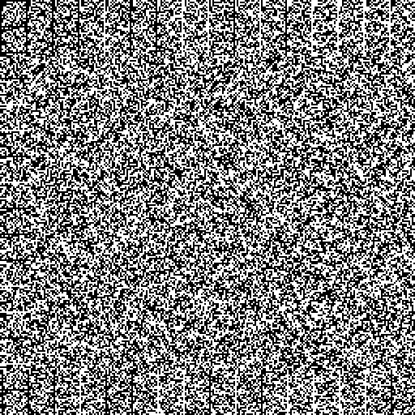
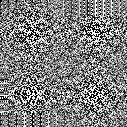

# de Bruijn Torus Generator
This is a Python implementation of the algorithms described in [1], which construct large de Bruijn tori from smaller ones.

A binary **de Bruijn torus** is an array of 0's and 1's that contains every m&times;n subarray exactly once, where opposite edges wrap around.

We say a torus has size (r, s; m, n) if the array has size r&times;s and the subarrays have size m&times;n. In the literature, a de Bruijn torus is often called a **de Bruijn array** or **perfect map**.

For example, shown below is an (8, 8; 3, 2) torus, generated by the file `sample-small.py`. Note that each of the 64 possible 3&times;2 subarrays (3 rows, 2 columns) appears exactly once in this torus, if we allow edges to wrap around.

  

These are (16, 32; 3, 3) and (256, 256; 4, 4) tori, respectively, which you can make using `sample-large.py`:

  
  

Here's a different (256, 256; 4, 4) torus, created with `sample-shiu.py`. This torus is identical to the one on the [Wikipedia article](https://en.wikipedia.org/wiki/De_Bruijn_torus).

  

There's also a (4096, 8192; 5, 5) torus in `results/output-5x5.png`, which is too large to show here. If you want, you can even create a (262144, 262144; 6, 6) torus on your own computer using `sample-6x6.py`! (Be warned, the storage file will take up 8 GiB disk space, and the images will take up over 6 GiB.)

## Requirements
* Python 3.6+
* [Pillow](https://pypi.org/project/Pillow/)

## Usage
The easiest way to start using the torus generator is by looking at the provided sample files.
* `sample-small.py` is a minimal example that creates a (8, 8; 3, 2) torus from a (4, 4; 2, 2) torus.
* `sample-large.py` creates (16, 32; 3, 3), (256, 256; 4, 4), and (4096, 8192; 5, 5) tori from a (4, 16; 3, 2) torus.
* `sample-shiu.py` creates a (256, 256; 4, 4) torus from a (4, 16; 3, 2) torus, using the specific seeds described in [2].
* `sample-6x6.py` creates a (262144, 262144; 6, 6) torus from a (4, 16; 3, 2) torus.

Here are the available methods for the Torus class:
* `Torus(values, m, n, storage)`
* *static* `Torus.debruijn(order)`
* `Torus.get_size()`
* `Torus.transpose()`
* `Torus.make(seed=None)`
* `Torus.save(name, tile_width=1, tile_height=1, square_size=1)`

The file `torus.py` contains comprehensive documentation for each of these methods.

## Features
* The torus is stored on disk and processed in chunks, so that only part of the torus is in RAM at a given time. As a result, you can work with a torus even if it's too large to fit in memory.
* The values of the torus are stored compactly as raw bytes on disk. Each value takes up only 1 bit of disk space.
* Bit operations are heavily used to speed up the construction. On my laptop, `sample-large.py` finishes in just under a second, and `sample-6x6.py` takes about 20 minutes. This is about 50x faster than a similar version without bit operations!

## References
[1] C.T. Fan, S.M. Fan, S.L. Ma, and M.K. Siu. "On de Bruijn arrays," *Ars Combinatoria*, Vol. 19A (1985), pp. 205-213.
 
[2] W.-C. Shiu. "Decoding de Bruijn arrays constructed by the FFMS method," *Ars Combinatoria*, Vol. 47 (1997), pp. 33-48.
